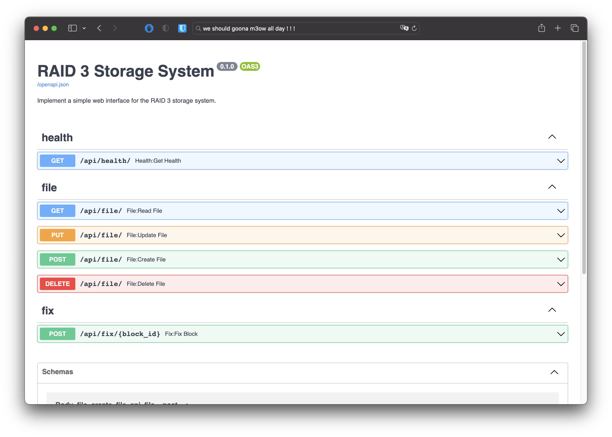

# Simple storage interface template

This is a simple storage interface template for students in NCKU's system administration course.

## Getting started

TA has already completed the section regarding the web app, so your focus should be on implementing the remaining part of `api/storage.py`.

### Prerequisites

-   python = '^3.8'
-   poetry = '^1.4.0'
-   make = '^1.4.0'

To ensure FreeBSD support, please make sure that `python3` and `pip3` are linked to the correct Python and pip versions. Additionally, please install Rust to support certain packages.

### Installation

1. The initialization environment will assist you in setting up Poetry, installing dependencies, and copying a new .env file.

```
make init
```

2. Optionally, you can install a pre-commit hook that ensures code quality each time you commit.

```
poetry run pre-commit install
```

3. Enter the environment and begin your development work.

```
poetry shell
```

4. Optionally, you can run the simple test case written by the TA to identify any potential issues in your code.

```
make test
```

5. Commence development of the API service, which will run at `http://localhost:8000`.

```
cd api && poetry run uvicorn app:APP --reload --host 0.0.0.0
```

### Formatting & Linting

Black, isort, flake8, and pylint are used for formatting and linting in this project. You can customize these settings in the `setup.cfg` file.

```
make lint format
```

### Develope

#### Swagger

FastAPI provides Swagger, an interactive API documentation and exploration web user interface that can be accessed at `http://localhost:8000/docs`.



#### Environment variable

The application will retrieve the setting variables from the environment, and if they are not found, it will retrieve the default variables from `api/config.py`.

| Name          | Default   | Comment                                                             |
| ------------- | --------- | ------------------------------------------------------------------- |
| UPLOAD_PATH   | /tmp      | the path where file should be placed.                               |
| FOLDER_PREFIX | block     | the storage folder prefix will be combined with `UPLOAD_PATH`.      |
| NUM_DISKS     | 5         | how many disk should simulate, the value should be between 3 to 10. |
| MAX_SIZE      | 104857600 | the max file size that can be upload, default is 100 MB.            |

### Reference

-   [tiangolo/fastapi](https://fastapi.tiangolo.com)
-   [arashi87/FastAPI-Template](https://github.com/arasHi87/FastAPI-Template)
-   [DarkbordermanTemplate/fastapi](https://github.com/DarkbordermanTemplate/fastapi)
